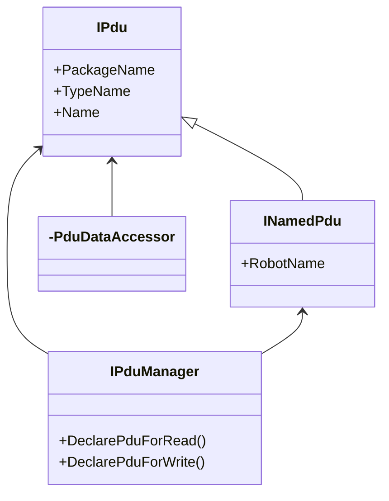

# hakoniwa-pdu-charp
A pure C# package implementing Hakoniwa PDU (Protocol Data Unit) for seamless communication in Hakoniwa simulations. Compatible with .NET and WebGL, it enables integration with AR, XR, and real robotic systems. Designed for flexibility without Unity dependencies, it provides a robust foundation for cross-layer communication.

# インストール方法

## Unityプロジェクトにインストールする場合

1. Unityプロジェクトを開きます。
2. `Packages/manifest.json` を開きます。
3. `"dependencies"` に以下の行を追加します。

```json
    "com.cysharp.unitask": "https://github.com/Cysharp/UniTask.git?path=src/UniTask/Assets/Plugins/UniTask",
    "com.endel.nativewebsocket": "https://github.com/endel/NativeWebSocket.git#upm",
    "com.hakoniwa-lab.hakoniwa-pdu": "https://github.com/toppers/hakoniwa-pdu-csharp.git#main",
```


## 補足

WebGL向けには、以下をインストールする必要があります。

```json
"com.endel.nativewebsocket": "https://github.com/endel/NativeWebSocket.git#upm"
```

# APIリファレンス

本パッケージは、箱庭PDUの通信を行うためのAPIを提供します。

通信APIは以下のクラスによって提供されます。

- [IPdu](Runtime/pdu/interfaces/IPdu.cs)
- [INamedPdu](Runtime/pdu/interfaces/INamedPdu.cs)
- [PduDataAccessor of ROS Data Types](Runtime/pdu/msgs)
- [IPduManager](Runtime/pdu/interfaces/IPduManager.cs)



## Ipdu

IPdu は、PDUデータを表現するためのインターフェースであり、PDUのパッケージ名(PackageName)、データ型(TypeName)およびデータ名(Name)を持ちます。

パッケージ名とデータ型は、ROSのトピックに相当します。データ名は、ROSのメッセージに相当します。

## PduDataAccessor

PDUデータへのアクセスは、キーバリュー形式で行うため、プログラムを容易化するするために、データ型毎にアクセサーを用意しています。


## INamedPdu

InamedPdu は、ロボット名を持つPDUデータを表現するためのインターフェースです。

PDUデータはロボットに所属するデータであり、ロボット名(RobtName)を持ちますので、本インタフェースでロボット毎のPDUデータを管理します。

## IPduManager

IPduManager は、PDUデータの通信を行うためのインターフェースです。

PDUデータの通信を行うためには、対応するPDUデータの送受信の宣言が必要であり、そのためのメソッドが提供されます。

- DeclarePduForRead: PDUデータの受信を宣言します。
- DeclarePduForWrite: PDUデータの送信を宣言します。

### 送信

PDUデータの送信は、以下の手順で行います。

1. ロボット名とPDU名を指定して空のINamedPduを作成します。
2. PDUデータアクセサを作成します。
3. PDUデータに値を設定します。
4. PDUデータをPDUバッファに書き込みします。
5. PDUデータをフラッシュして送信します。

例：geometry_msgs/Twist型のPDUデータを送信する場合

```csharp
//1. ロボット名とPDU名を指定して空のINamedPduを作成します。
INamedPdu npdu_pos = pdu_manager.CreateNamedPdu("robotName", "possition");
//2. PDUデータアクセサを作成します。
Twist pos = new Twist(npdu_pos.Pdu);
//3. PDUデータに値を設定します。
SetPosition(pos, unity_pos);
//4. PDUデータをPDUバッファに書き込みします。
pdu_manager.WriteNamedPdu(npdu_pos);
//5. PDUデータをフラッシュして送信します。
await pdu_manager.FlushNamedPdu(npdu_pos);
```

### 受信

PDUデータの受信は、以下の手順で行います。
1. ロボット名とPDU名を指定して、最新のPDUデータ取得します。
2. PDUデータアクセサを作成します。
3. PDUデータから値を取得します。

```csharp
//1. ロボット名とPDU名を指定して、最新のPDUデータ取得します。
var pdu = pduManager.ReadPdu(robotName, pduName);
//2. PDUデータアクセサを作成します。
Twist twist = new Twist(pdu);
//3. PDUデータから値を取得します。
this.transform.position = hakoniwa.pdu.Frame.toUnityPosFromPdu(twist.linear);
```
