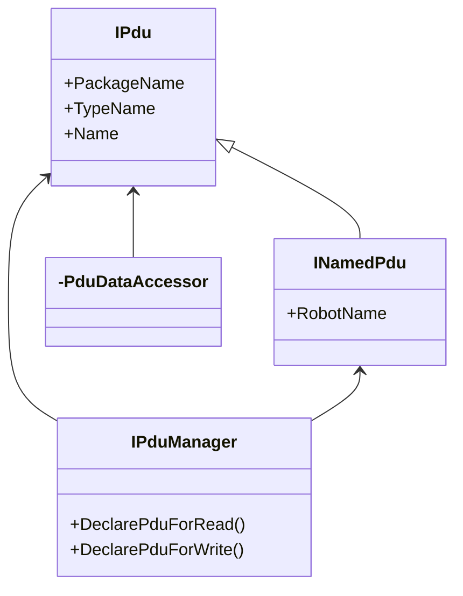

# hakoniwa-pdu-csharp

箱庭の PDU 通信を C# / Unity / WebGL から扱うためのパッケージです。

English README: [README_en.md](./README_en.md)

このパッケージでできること:

- PDU 定義に基づいて型付き PDU を生成する
- PDU を read / write / flush する
- UDP / WebSocket / WebGL / Dummy で通信する
- 既存の legacy 構成と、新しい compact / packet v2 構成の両方を扱う

初見の利用者向けに先に要点だけ書くと、次の理解で十分です。

- 既存の `custom.json` と従来通信はそのまま使えます
- 新しく構成するなら `compact` 定義と `packet v2` を推奨します
- `packet v2` を使うときは、通常 `hakoniwa-webserver` ではなく `hakoniwa-pdu-endpoint` / `hakoniwa-pdu-bridge-core` 側へ寄せます
- `DeclarePduForRead / DeclarePduForWrite` は互換 API として残ります

## どの利用者向けか

この README は、まず以下の利用者を想定しています。

- Unity から箱庭 PDU を送受信したい人
- 既存の `hakoniwa-webserver` 構成を維持したい人
- 新しく bridge / endpoint ベース構成へ移行したい人

上位リポジトリを含む詳細な移行判断は [MIGRATION_GUIDE.md](./MIGRATION_GUIDE.md) を参照してください。

## はじめに何を選べばよいか

| やりたいこと | 選ぶもの |
| --- | --- |
| 既存構成をそのまま動かしたい | `legacy` + `v1` |
| 新規で構成したい | `compact` + `v2` |
| 既存構成のまま段階移行したい | まず `legacy` + `v1` のまま更新し、その後 `compact`、最後に `v2` |

## インストール

### Unity プロジェクト

`Packages/manifest.json` の `"dependencies"` に追加します。

```json
"com.cysharp.unitask": "https://github.com/Cysharp/UniTask.git?path=src/UniTask/Assets/Plugins/UniTask",
"com.endel.nativewebsocket": "https://github.com/endel/NativeWebSocket.git#upm",
"com.hakoniwa-lab.hakoniwa-pdu": "https://github.com/toppers/hakoniwa-pdu-csharp.git#main"
```

WebGL では `com.endel.nativewebsocket` が必要です。

## 最小イメージ

送信:

```csharp
IEnvironmentService service = EnvironmentServiceFactory.Create("dummy");
PduManager pduManager = new PduManager(service, configPath, customJsonPath);
await pduManager.StartService();

INamedPdu npdu = pduManager.CreateNamedPdu("robot", "pos");
Twist pos = new Twist(npdu.Pdu);
pos.linear.x = 1.0;
pduManager.WriteNamedPdu(npdu);
await pduManager.FlushNamedPdu(npdu);
```

受信:

```csharp
var pdu = pduManager.ReadPdu("robot", "pos");
Twist pos = new Twist(pdu);
```

## 1.6.0 で何が変わったか

`1.6.0` は、既存 API を壊さずに新しい運用モデルを追加した版です。

追加された主なもの:

1. PDU 定義の `compact` 形式対応
2. 通信 packet `v2` 対応

意味合いとしては、

- 既存利用者:
  - すぐに書き換えなくてよい
- 新規利用者:
  - compact / v2 を選べる
- 段階移行したい利用者:
  - 旧構成を保ったまま順番に移行できる

というリリースです。

## API リファレンス

本パッケージは、箱庭PDUの通信を行うためのAPIを提供します。

通信APIは以下のクラスによって提供されます。

- [IPdu](Runtime/pdu/interfaces/IPdu.cs)
- [INamedPdu](Runtime/pdu/interfaces/INamedPdu.cs)
- [PduDataAccessor of ROS Data Types](Runtime/pdu/msgs)
- [IPduManager](Runtime/pdu/interfaces/IPduManager.cs)



## Ipdu

IPdu は、PDUデータを表現するためのインターフェースであり、PDUのパッケージ名(PackageName)、データ型(TypeName)およびデータ名(Name)を持ちます。

パッケージ名とデータ型は、ROSのトピックに相当します。データ名は、ROSのメッセージに相当します。

## PduDataAccessor

PDUデータへのアクセスは、キーバリュー形式で行うため、プログラムを容易化するするために、データ型毎にアクセサーを用意しています。


## INamedPdu

InamedPdu は、ロボット名を持つPDUデータを表現するためのインターフェースです。

PDUデータはロボットに所属するデータであり、ロボット名(RobtName)を持ちますので、本インタフェースでロボット毎のPDUデータを管理します。

## IPduManager

IPduManager は、PDUデータの通信を行うためのインターフェースです。

PDUデータの通信を行うためには、対応するPDUデータの送受信の宣言が必要であり、そのためのメソッドが提供されます。

- DeclarePduForRead: PDUデータの受信を宣言します。
- DeclarePduForWrite: PDUデータの送信を宣言します。

### 送信

PDUデータの送信は、以下の手順で行います。

1. ロボット名とPDU名を指定して空のINamedPduを作成します。
2. PDUデータアクセサを作成します。
3. PDUデータに値を設定します。
4. PDUデータをPDUバッファに書き込みします。
5. PDUデータをフラッシュして送信します。

例：geometry_msgs/Twist型のPDUデータを送信する場合

```csharp
//1. ロボット名とPDU名を指定して空のINamedPduを作成します。
INamedPdu npdu_pos = pdu_manager.CreateNamedPdu("robotName", "possition");
//2. PDUデータアクセサを作成します。
Twist pos = new Twist(npdu_pos.Pdu);
//3. PDUデータに値を設定します。
SetPosition(pos, unity_pos);
//4. PDUデータをPDUバッファに書き込みします。
pdu_manager.WriteNamedPdu(npdu_pos);
//5. PDUデータをフラッシュして送信します。
await pdu_manager.FlushNamedPdu(npdu_pos);
```

### 受信

PDUデータの受信は、以下の手順で行います。
1. ロボット名とPDU名を指定して、最新のPDUデータ取得します。
2. PDUデータアクセサを作成します。
3. PDUデータから値を取得します。

```csharp
//1. ロボット名とPDU名を指定して、最新のPDUデータ取得します。
var pdu = pduManager.ReadPdu(robotName, pduName);
//2. PDUデータアクセサを作成します。
Twist twist = new Twist(pdu);
//3. PDUデータから値を取得します。
this.transform.position = hakoniwa.pdu.Frame.toUnityPosFromPdu(twist.linear);
```

# 移行ガイド

`1.5.1` から `1.6.0` への移行では、次の 4 点だけ押さえれば十分です。

| 項目 | 従来 | 新規推奨 | 補足 |
| --- | --- | --- | --- |
| PDU 定義 | legacy | compact | 両対応 |
| packet | v1 | v2 | 既定値は v1 |
| 接続先 | `hakoniwa-webserver` | `hakoniwa-pdu-bridge-core` + `hakoniwa-pdu-endpoint` | v2 は接続先切替が前提 |
| 宣言方法 | 動的 declare | 宣言型設定 | API は互換維持 |

利用者向けの要点:

- 既存の legacy / v1 構成はそのまま動かせます
- 新規構成では compact / v2 を推奨します
- v2 の指定は `DataPacket` ではなく `comm_service_config.json` の `commRawVersion` で行います
- v2 + bridge-core 構成では `DeclarePduForRead / Write` は通常不要です

詳細は以下を参照してください。

- 日本語版: [MIGRATION_GUIDE.md](./MIGRATION_GUIDE.md)
- 英語版: [MIGRATION_GUIDE_en.md](./MIGRATION_GUIDE_en.md)
